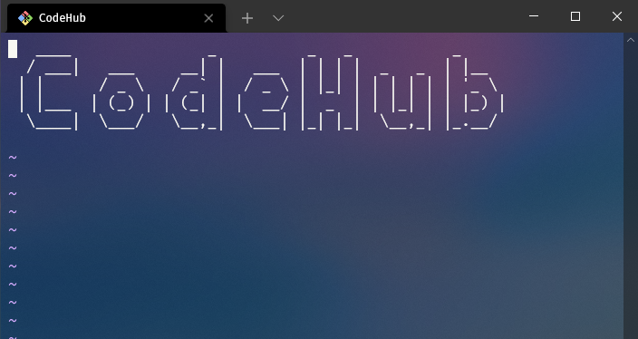

# CodeHub


---

## 🤔 Sobre

O **CodeHub** é um controlador de versão de códigos simplificado e próprio para os estudantes do campus, com isso, os alunos além de aprenderem a utilizar versionadores de códigos, poderão publicar seus scripts, desse modo, conseguirão interagir com o código um dos outros, portanto, ajudando e trabalhando em equipe para aprimorar os projetos.




## 📁 Instalação	

Para instalar, basta usar o seguinte comando:

```
git clone https://github.com/eoisaac/CodeHub.git
```

## 🔧 Tecnologias

O projeto foi desenvolvido utilizando as seguintes tecnologias:
- Java

## 👨‍💻 Desenvolvedores

- [Riquelme Damião](https://github.com/the-riquelme)
- [Paloma Bárbara](https://github.com/palomabarbara)
- [Marcus Vinícius](https://github.com/pymarcus)
- [João Gabriel](https://github.com/Gabrieljr42)
- [Isaac Santiago](https://github.com/eoisaac)

---

[⬆ Voltar ao topo](#CodeHub)